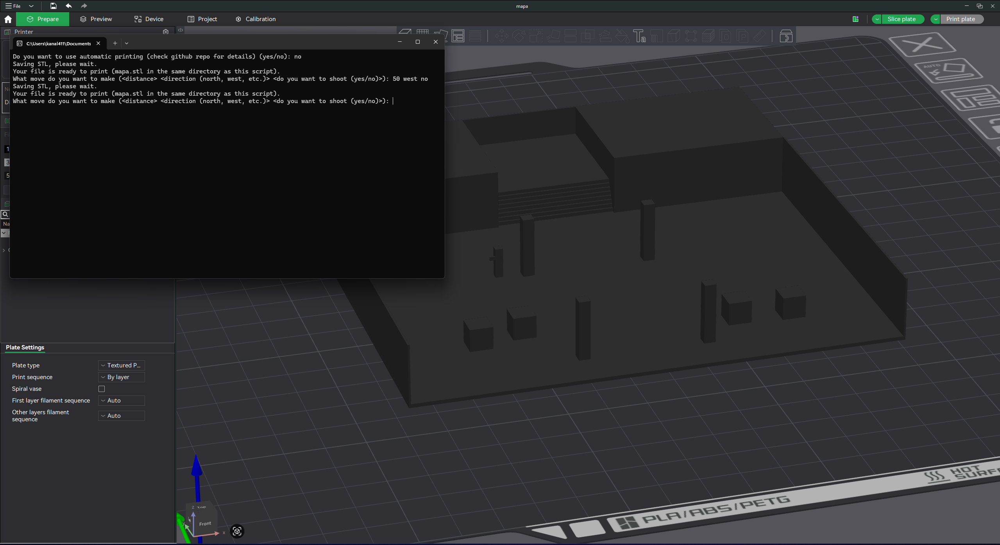
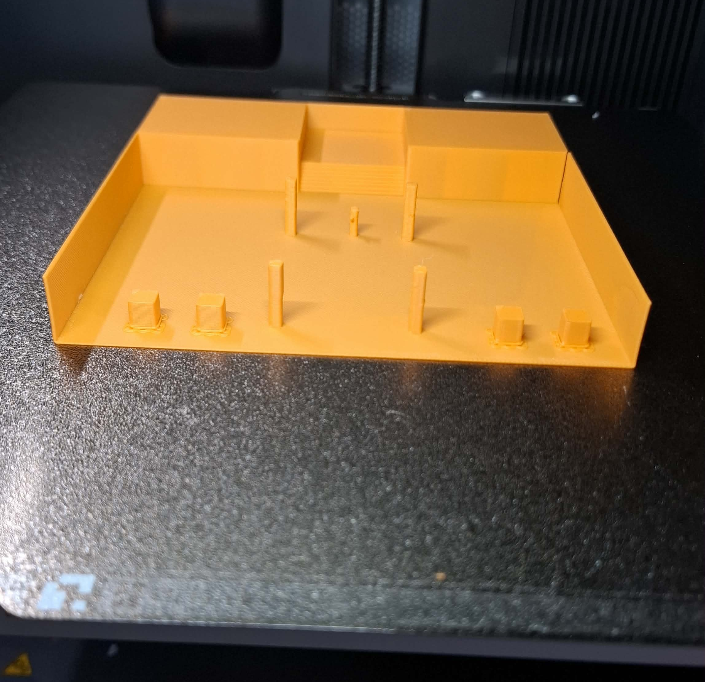

# doomREAL3D
Simple turn-based shooter that instead of displaying gameplay on a monitor, prints it on a 3D printer.

## Requirements
- Windows
### Automatic printing requirements (optional)
- Python 3
- pyautogui
- Bambu Studio connected to your printer

## Setup
1. Download and unzip the latest release.
2. (Only for automatic printing) If your primary monitor is not 1440p: edit `print.py` and adjust the pixel coordinate variables at the top of the file.
3. Run `3dDoom.exe`.

## How to play
Each turn you enter instructions in the form of \<distance\> \<direction\> \<shoot\> (for example: "5 north no" or "10 west yes"). Your goal is to eliminate all 4 enemies. If they get too close, you lose. The map is a 255×255 grid with simple stairs, an elevated platform, and four pillars.

## Automatic printing
This is experimental function, it automates keyboard and mouse input; may interfere with other applications. It is vulnerable to changes in Bambu Studio UI, and requires adjustments in print.py for every resolutions except 1440p.

## Gallery

## YouTube video

*Click the preview above to watch the demo.*

## AI usage
AI was used for debugging and help with generating STL from c++.
